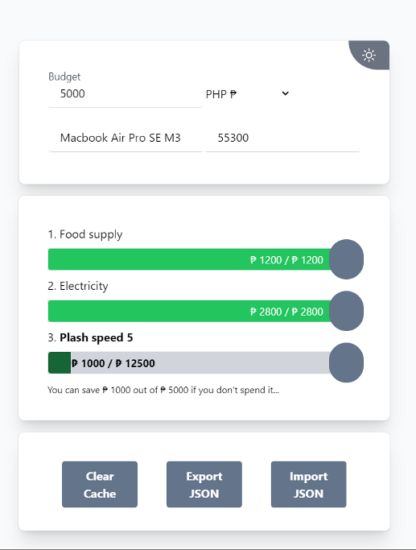

# budget-wishlist

Budget Wishlist single page web app made with TailwindCSS and AlpineJS

You can...
- [x] set your budget, 
- [x] add items to your wishlist with their cost, 
- [x] rearrange them by spending priority 
- [x] and see how much you save if you don't spend the last item.
- [ ] add / subtract your budget.
- [ ] personalized theme.
- [ ] launch as homescreen app.

The app also supports changing the display currency, importing and exporting JSON, and storing data locally.

